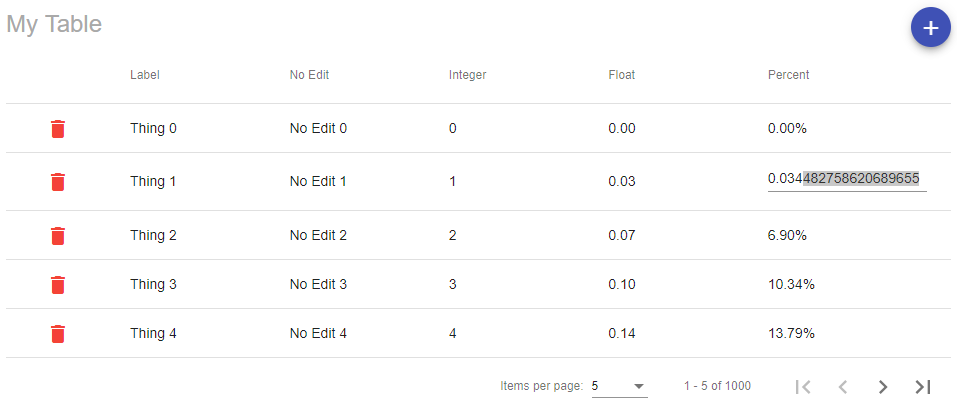

# NgST Demo Application

This repository contains the code to develop, test, demo, and distribute NGST.

If you wish to include NGST in your Angular application please see the [module's readme](./src/app/ngst/README.md).




## Running the Demo/Development

#### Install dependencies
```bash
yarn
```

#### Run the demo
```bash
yarn start
```

## Building and publishing new versions of the lib to NPM
#### Increment the version number
In `src/app/ngst/package.json` increment `"version"`/

#### Build NgST lib
```bash
yarn build:lib
```
OR
```bash
npm run build:lib
```

#### Pack
```bash
npm pack dist
```

#### Distribute
You will need to have npm permissions and be logged in. Your terminal will prompt you for creds.
```bash
npm publish dist
```

## Installing a local instance of NgST for testing
1. [Build NgST lib](#build-ngst-lib)
2. Navigate to the project directory you wish to install the previously built version of NgST
3. `yarn add file:<\path\to\ngst\dist>` or `npm install <\path\to\ngst\dist>` __Note: This should only be done when developing changes for NgST. When actually install NgST simply `yarn add ngst` or `npm install ngst`__
